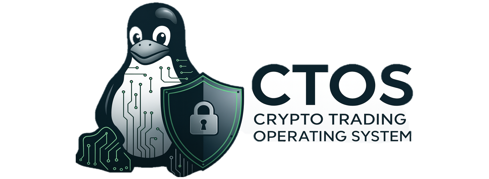
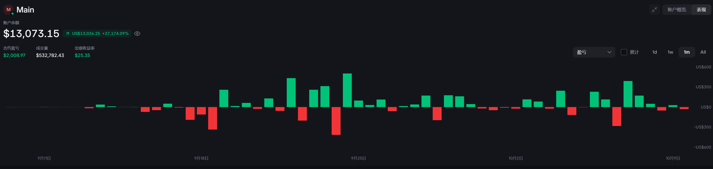

🌐 Languages: [English](README_EN.md) | [中文](README.md) | [日本語](scripts/README_JP.md) | [한국어](scripts/README_KR.md)


## CTOS：加密交易操作系统（借鉴 Linux 设计理念）

**范围：** 面向中心化交易所（CEX）的量化交易（初期支持 OKX、Backpack、Binance）。
**设计说明：** CTOS 借鉴了 Linux 的理念（架构 arch、驱动 driver、系统调用 syscall、调度器 scheduler、进程 processes），但并非完全复制，而是有选择地吸收适合于构建健壮、可组合、可移植的交易系统的思想。

### 为什么是 CTOS？

* **可移植性：** 通过 **统一的交易系统调用（syscall）** 屏蔽不同交易所的差异。
* **可组合性：** 策略 = “进程”；交易所适配器 = “驱动”；每个交易所 = “架构”。
* **可靠性：** 内核 / 运行时 / 驱动 的分层设计提高了可测试性与安全性。
* **可观测性：** 结构化日志、指标和可复现的回测能力。
* **高鲁棒性** 对齐了所有交易所的下单价格与数量精度，指定金额下单，自动转化，全程无忧。

## 📚 目录

- [CTOS：加密交易操作系统（借鉴 Linux 设计理念）](#ctos加密交易操作系统借鉴-linux-设计理念)
  - [为什么是 CTOS？](#为什么是-ctos)
  - [安全特性](#️-安全特性)
  - [性能特性](#-性能特性)
  - [CTOS 设计目标（小白友好版）](#ctos-设计目标小白友好版)
  - [快速开始（实践流程）](#快速开始（实践流程）)
  - [概念映射（Linux → CTOS）](#概念映射linux--ctos)
  - [项目目录结构](#项目目录结构)

> 可点击上方目录快速跳转到对应章节。

---

## 概念映射（Linux → CTOS）

| Linux 概念       | CTOS 对应                                                          | 说明                                                                                     |
| -------------- | ---------------------------------------------------------------- | -------------------------------------------------------------------------------------- |
| `arch/`        | **交易所架构** (`drivers/okx`, `drivers/binance`, `drivers/backpack`) | 每个交易所一个文件夹，隔离 REST / WS / 签名 / 规格实现。                                                   |
| 设备驱动           | **交易所驱动**                                                        | REST/WS 客户端、签名器、符号映射、功能开关。                                                             |
| 系统调用           | **交易系统调用**                                                       | `place_order`、`cancel_order`、`amend_order`、`balances`、`positions`、`subscribe_ticks` 等。 |
| 调度器            | **策略调度器**                                                        | 协调策略“进程”，处理限速、重试、执行顺序。                                                                 |
| 进程             | **策略**                                                           | 无状态/有状态的策略，调用 syscall，由运行时监督管理。                                                        |
| 文件系统           | **存储层**                                                          | Parquet/SQLite 保存市场数据、成交、标记价格、快照、配置等。                                                  |
| `/proc`        | **指标与运行态信息**                                                     | 健康状态、PnL、风险、延迟、交易所限额、已打开的 websocket。                                                   |
| `init`/systemd | **监督进程**                                                         | 启动模块、重启、隔离崩溃、滚动更新。                                                                     |

---

## 项目目录结构

```
ctos/
├─ README.md                    # 项目说明文档
├─ pyproject.toml              # Python项目配置
├─ requirements.txt            # Python依赖包
├─ environment.yml             # Conda环境配置
├─ configs/                    # 配置管理目录
│  ├─ account.yaml             # 账户配置文件（API密钥）
│  ├─ account_reader.py        # 账户配置读取器
│  ├─ config_reader.py         # 通用配置读取器
│  └─ example_usage.py         # 配置使用示例
├─ ctos/                       # 核心代码目录
│  ├─ core/                    # 核心系统模块
│  │  ├─ kernel/               # 系统内核
│  │  │  ├─ syscalls.py        # 统一交易系统调用接口
│  │  │  ├─ scheduler.py       # 策略调度器
│  │  │  └─ event_bus.py       # 事件总线
│  │  ├─ runtime/              # 运行时系统
│  │  │  ├─ ExecutionEngine.py # 执行引擎（核心）
│  │  │  ├─ SystemMonitor.py   # 系统监控器
│  │  │  ├─ AccountManager.py  # 账户管理器
│  │  │  ├─ RiskWatcher.py     # 风险监控器
│  │  │  ├─ SignalGenerator.py # 信号生成器
│  │  │  ├─ DataHandler.py     # 数据处理器
│  │  │  └─ IndicatorCalculator.py # 指标计算器
│  │  └─ io/                   # 输入输出模块
│  │     ├─ logging/           # 日志系统
│  │     ├─ datafeed/          # 数据源接入
│  │     └─ storage/           # 数据存储
│  └─ drivers/                 # 交易所驱动
│     ├─ okx/                  # OKX交易所驱动
│     │  ├─ driver.py          # OKX主驱动
│     │  └─ util.py            # OKX工具函数
│     ├─ backpack/             # Backpack交易所驱动
│     │  ├─ driver.py          # Backpack主驱动
│     │  └─ util.py            # Backpack工具函数
│     └─ binance/              # Binance交易所驱动
├─ apps/                       # 应用层
│  ├─ strategies/              # 交易策略
│  │  ├─ grid/                 # 网格策略
│  │  │  └─ Grid-All-Coin.py   # 全币种网格策略
│  │  ├─ hedge/                # 对冲策略
│  │  ├─ rank/                 # 排名策略
│  │  └─ examples/             # 示例策略
│  ├─ indicatorVisualization/  # 指标可视化
│  └─ website/                 # Web界面
├─ tools/                      # 工具集
├─ scripts/                    # 脚本文件
└─ tests/                      # 测试文件
```

### 🔥 核心文件说明

#### 系统核心
- **`ctos/core/runtime/ExecutionEngine.py`** - 执行引擎，系统核心，负责策略执行和系统调用
- **`ctos/core/runtime/SystemMonitor.py`** - 系统监控器，负责仓位监控、异常检测和自动纠正
- **`ctos/core/kernel/syscalls.py`** - 统一交易系统调用接口，屏蔽交易所差异

#### 交易所驱动
- **`ctos/drivers/okx/driver.py`** - OKX交易所驱动，支持动态账户映射
- **`ctos/drivers/backpack/driver.py`** - Backpack交易所驱动，支持动态账户映射
- **`ctos/drivers/binance/driver.py`** - Binance交易所驱动

#### 配置管理
- **`configs/account.yaml`** - 账户配置文件，存储各交易所API密钥
- **`configs/account_reader.py`** - 账户配置读取器，支持动态账户管理

#### 交易策略
- **`apps/strategies/grid/Grid-All-Coin.py`** - 全币种网格策略，集成ExecutionEngine
- **`apps/strategies/examples/`** - 示例策略集合

#### 监控与日志
- **`ctos/core/io/logging/`** - 日志目录，包含：
  - `{exchange}_Account{id}_{strategy}_system_monitor.log` - 系统监控日志
  - `{exchange}_Account{id}_{strategy}_operation_log.log` - 操作日志
  - `{exchange}_account{id}_position_backup.json` - 仓位备份
  - `{exchange}_account{id}_anomaly_report.json` - 异常报告

---

## 交易系统调用（统一接口）

> 每个交易所的 driver 必须实现这些接口；策略通过 ExecutionEngine 调用 syscall。

### 🚀 核心功能概览

#### 行情相关
- **`get_price_now(symbol)`** - 获取最新成交价
- **`get_orderbook(symbol, level)`** - 获取订单簿（bids/asks）
- **`get_klines(symbol, timeframe, limit, start_time, end_time)`** - 获取K线数据
- **`fees(symbol, limit, offset)`** - 获取资金费率

#### 交易相关
- **`place_order(symbol, side, order_type, size, price=None, **kwargs)`** - 下单
- **`revoke_order(order_id, symbol)`** - 撤单
- **`amend_order(order_id, symbol, ...)`** - 改单（查单→撤单→下单）
- **`get_open_orders(symbol=None, instType='SWAP')`** - 获取未完成订单
- **`get_order_status(order_id, keep_origin=False)`** - 查询订单状态
- **`cancel_all(symbol)`** - 撤销指定交易对全部订单

#### 账户/仓位
- **`fetch_balance(currency)`** - 获取余额（支持多币种）
- **`get_position(symbol=None, keep_origin=False)`** - 获取仓位信息
- **`close_all_positions(symbol=None)`** - 平仓所有仓位

### 🔧 执行引擎功能

#### ExecutionEngine 核心方法
- **`place_incremental_orders(amount, coin, side, soft=True)`** - 增量下单
- **`set_coin_position(coin, usdt_amount, soft=True)`** - 设置币种仓位
- **`_order_tracking_logic(coins, soft_orders_to_focus)`** - 订单追踪逻辑

#### 系统监控功能
- **`monitor_positions()`** - 仓位监控（支持自动纠正）
- **`get_position_summary()`** - 获取仓位汇总
- **`get_anomaly_summary()`** - 获取异常汇总
- **`start_position_monitoring()`** - 启动连续监控

### 📊 支持的交易所

| 交易所 | 驱动文件 | 账户支持 | 特殊功能 |
|--------|----------|----------|----------|
| **OKX** | `drivers/okx/driver.py` | 动态账户映射 | 完整的期货交易支持 |
| **Backpack** | `drivers/backpack/driver.py` | 动态账户映射 | 原生永续合约支持 |
| **Binance** | `drivers/binance/driver.py` | 基础支持 | 全球最大交易所 |

### 🎯 动态账户管理

所有交易所驱动都支持通过 `account_id` 参数动态选择账户：

```python
# 使用主账户 (account_id=0)
engine = ExecutionEngine(account=0, exchange_type='okx')

# 使用子账户 (account_id=1)
engine = ExecutionEngine(account=1, exchange_type='backpack')

# 使用第三个账户 (account_id=2)
engine = ExecutionEngine(account=2, exchange_type='okx')
```

账户映射基于 `configs/account.yaml` 配置文件：
- `account_id=0` → 第一个账户（通常是main）
- `account_id=1` → 第二个账户（通常是sub1）
- `account_id=2` → 第三个账户（通常是sub2）

---

## 🏗️ 系统架构

```
┌─────────────────────────────────────────────────────────────┐
│                        CTOS 系统架构                          │
├─────────────────────────────────────────────────────────────┤
│  ┌─────────────────┐  ┌─────────────────┐  ┌─────────────────┐ │
│  │   应用层 (Apps)   │  │   配置层 (Config) │  │   工具层 (Tools)  │ │
│  │                │  │                │  │                │ │
│  │ • 网格策略       │  │ • 账户配置       │  │ • 回测工具       │ │
│  │ • 对冲策略       │  │ • 系统配置       │  │ • 模拟器        │ │
│  │ • 排名策略       │  │ • 密钥管理       │  │ • 可视化        │ │
│  └─────────────────┘  └─────────────────┘  └─────────────────┘ │
├─────────────────────────────────────────────────────────────┤
│  ┌─────────────────────────────────────────────────────────┐ │
│  │                  核心运行时 (Core Runtime)                │ │
│  │  ┌─────────────┐  ┌─────────────┐  ┌─────────────┐    │ │
│  │  │ 执行引擎     │  │ 系统监控     │  │ 账户管理     │    │ │
│  │  │ExecutionEngine│  │SystemMonitor│  │AccountManager│    │ │
│  │  └─────────────┘  └─────────────┘  └─────────────┘    │ │
│  │  ┌─────────────┐  ┌─────────────┐  ┌─────────────┐    │ │
│  │  │ 风险监控     │  │ 信号生成     │  │ 数据处理     │    │ │
│  │  │RiskWatcher  │  │SignalGenerator│  │DataHandler  │    │ │
│  │  └─────────────┘  └─────────────┘  └─────────────┘    │ │
│  └─────────────────────────────────────────────────────────┘ │
├─────────────────────────────────────────────────────────────┤
│  ┌─────────────────────────────────────────────────────────┐ │
│  │                   系统内核 (Kernel)                      │ │
│  │  ┌─────────────┐  ┌─────────────┐  ┌─────────────┐    │ │
│  │  │ 系统调用     │  │ 策略调度     │  │ 事件总线     │    │ │
│  │  │  syscalls   │  │  scheduler  │  │  event_bus  │    │ │
│  │  └─────────────┘  └─────────────┘  └─────────────┘    │ │
│  └─────────────────────────────────────────────────────────┘ │
├─────────────────────────────────────────────────────────────┤
│  ┌─────────────────────────────────────────────────────────┐ │
│  │                   交易所驱动 (Drivers)                   │ │
│  │  ┌─────────────┐  ┌─────────────┐  ┌─────────────┐    │ │
│  │  │   OKX       │  │  Backpack   │  │  Binance    │    │ │
│  │  │   Driver    │  │   Driver    │  │   Driver    │    │ │
│  │  └─────────────┘  └─────────────┘  └─────────────┘    │ │
│  └─────────────────────────────────────────────────────────┘ │
├─────────────────────────────────────────────────────────────┤
│  ┌─────────────────────────────────────────────────────────┐ │
│  │                   数据存储 (Storage)                     │ │
│  │  ┌─────────────┐  ┌─────────────┐  ┌─────────────┐    │ │
│  │  │   日志       │  │   数据源     │  │   存储       │    │ │
│  │  │  Logging    │  │  DataFeed   │  │  Storage    │    │ │
│  │  └─────────────┘  └─────────────┘  └─────────────┘    │ │
│  └─────────────────────────────────────────────────────────┘ │
└─────────────────────────────────────────────────────────────┘
```

### 🔄 数据流向
1. **策略** → **执行引擎** → **系统调用** → **交易所驱动** → **交易所API**
2. **交易所API** → **交易所驱动** → **系统调用** → **执行引擎** → **系统监控**
3. **系统监控** → **异常检测** → **自动纠正** → **执行引擎** → **交易所驱动**

---

## 🌟 系统特性

### 🔥 核心功能
- **统一交易接口** - 一套API支持OKX、Backpack、Binance三大交易所
- **动态账户管理** - 支持多账户切换，基于配置文件自动映射
- **智能仓位监控** - 基于quantityUSD的精准监控，支持自动纠正
- **多维度异常检测** - 价格、仓位、收益、风险全方位监控
- **自动纠正机制** - 检测到异常时自动下单纠正
- **完整日志系统** - 结构化日志、操作记录、异常报告

### 🛡️ 安全特性
- **风险控制** - 内置风控模块，支持多种风险指标监控
- **账户隔离** - 多账户独立管理，避免交叉影响
- **操作审计** - 完整的操作记录和异常追踪
- **自动熔断** - 异常情况下自动停止交易

### 🚀 性能特性
- **高精度计算** - 统一处理不同交易所的精度差异
- **智能下单** - 自动处理价格和数量精度转换
- **增量交易** - 支持增量下单，避免重复操作
- **实时监控** - 支持连续监控和定时任务

---

### 🎯 CTOS 设计目标（小白友好版）

1. **开箱即用** — 一键启动，无需复杂环境。
   👉 新手也能在几分钟内跑起第一个交易策略。

2. **免写代码** — 内置常见策略。
   👉 “均值回归”、“网格”、“对冲”一条命令就能跑，不会编程也能玩。

3. **多交易所统一接口**
   👉 一个系统同时对接 OKX、Binance、Backpack，不必重复学各种 API。

4. **默认安全保护**
   👉 自带风控和紧急熔断，帮你避免新手常见的大额亏损。

5. **先模拟，后实盘**
   👉 先用“虚拟资金”训练和测试，放心学习，不怕亏钱。

6. **结果可视化**
   👉 自动生成收益、风险、表现的图表报告，让你一眼看懂。

7. **循序渐进学习**
   👉 先用现成策略 → 再改配置参数 → 最后想学编程时自己写。

---

## 快速开始（实践流程）
> ⚠️ 如遇网络连接问题，请确保已配置科学上网环境以顺利访问交易所API。
> 💡 网络或API连通性排查建议：可运行 `python scripts/net_probe.py`，自动检测本地到 OKX、Backpack、Binance 等交易所的网络连通性、DNS、TLS 及驱动可用性，并给出详细诊断和修复建议。


1. **获取代码**
   克隆仓库或下载模板：

   ```bash
   git clone https://github.com/CryptoFxxker/CTOS.git
   cd ctos
   ```

2. **搭建环境**

   ```bash
   conda create -n ctos python=3.10 -y
   conda activate ctos
   pip install -U pip
   pip install -r requirements.txt
   ```

   windows环境下
   ```bash
   conda env create -f environment-win.yml --name ctos
   ```

3. **配置 API Key**

   ```bash
   cp configs/secrets.example.yaml configs/account.yaml
   ```

   填入 **OKX / Backpack / （Binance）** 的 API Key
   > ⚠️ 请勿将该文件提交到 git

 ### 3.1 测试用例（可选）

   如需验证环境和 API Key 配置是否正确，可运行内置测试脚本：

   ```bash
   python configs/example_usage.py
   ```

   该脚本会自动对 OKX 和 Backpack 交易所的主流币种进行下单测试，并输出结果。建议首次部署时先运行，确保一切正常。


4. **运行内置策略**

   ```bash
   # 运行全币种网格策略 (这个策略可以去看看，有介绍，只需要会打字就能跑了。)
   python apps/strategies/grid/Grid_with_more_gap.py
   
   # 或运行其他策略
   python apps/strategies/examples/your_strategy.py
   ```

   策略会自动使用 ExecutionEngine 和 SystemMonitor 进行执行和监控。

6. **回测/重放@TODO** 
   将历史数据放入 `tools/backtest/`，然后：

   ```bash
   ./scripts/backtest.sh
   ```

   结果会写入 `var/logs/` 并存储在 `var/data/`。

👉 流程一目了然：**获取代码 → 安装环境 → 填 API Key → 配置 → 实盘上线**

---

##  Roadmap

* **v0.1**
  系统调用规范；交易所驱动（OKX/Backpack/Binance）骨架；运行时调度；模拟交易

* **v0.2**
  统一 WebSocket 数据流；回测与模拟一致性；更丰富的风控模块

* **v0.3**
  多交易所投资组合净额管理；实时容灾；热重启；更强的指标与用户界面

* **🎉 里程碑 1（2025.09.17）**
  * ✅ 完成了两个交易所 API 的统一设计与抽象。
  * 🚀 在今天达成重要里程碑：**基于系统调用，由 AI 自动化生成的网格策略代码** 已完成，并经过微调后正式上线！
  * 🥂🎊 恭喜上线，未来可期！


* **🎉 里程碑 2（2025.09.23）**
  * ✅ 完成了基于quantityUSD的精准仓位监控系统
  * ✅ 实现了多维度异常检测（价格、仓位、收益、风险）
  * ✅ 完成了自动纠正机制，支持仓位异常自动修复
  * ✅ 实现了完整的日志系统和数据持久化
  * ✅ 支持OKX、Backpack三大交易所
  * 🚀 系统已具备生产环境部署能力！
  * 🥂🎊 恭喜上线，未来可期！

* **🎉 里程碑 3（2025.01.20）**
  * ✅ 完成了完整的量化交易策略体系构建
  * ✅ 实现了多账户、多策略的并行运行架构
  * ✅ 建立了指数面、辅助面、新币流三大策略分类
  * ✅ 支持动态参数调整和实时监控
  * 🚀 策略体系已全面上线运行！

### 📊 策略体系总览

| 策略分类 | 策略名称 | 运行账户 | 策略特点 | 状态 |
|---------|---------|---------|---------|------|
| **指数面策略** | 主力策略 | 0, 3 | 波动大+次数多，杠杆累进对冲网格 | ✅ 运行中 |
| | 小波动马丁策略 | 2, 4 | 波动小+次数多，杠杆指数爆炸对冲网格 | ✅ 运行中 |
| **辅助面策略** | 动态网格策略 | 0, 3 | 指定币种±3.88/1.88挂单，动态调整 | ✅ 运行中 |
| | 狙击飞升策略 | 0, 3, 4 | 超BTC 1%卖出3U，买入BTC/BNB | ✅ 运行中 |
| | Rank策略 | 2 | 涨幅前50%做多，后50%做空 | 🚧 开发中 |
| **新币流策略** | 狙击大市值新币 | 1 | 新币做空+动态网格，10刀止损 | 🚧 开发中 |

### 🎯 策略核心特性

- **多账户管理**：支持5个账户并行运行不同策略
- **动态参数调整**：实时监控市场变化，自动调整策略参数
- **风险控制**：每策略独立风控，支持熔断和止损
- **实时监控**：完整的日志系统和数据持久化
- **策略轮换**：根据市场情况自动切换最优策略组合

---

## 安全与合规

* **最小权限**：API Key 仅开通必要权限，提现永远关闭。
* **密钥安全**：使用 `configs/secrets.yaml`（未纳入版本控制），或系统密钥管理、环境变量。
* **风控优先**：下单检查、熔断、Kill-switch、速率与日志留痕。
* **回测可复现**：所有策略输入/输出与行情快照可回放。

---

## 许可与免责声明

* **免责声明**：加密货币交易风险极高。CTOS 仅作为研究与工具框架，请自行评估风险并承担责任。
* **License**：可自行选择（MIT / Apache-2.0 / GPL-3.0），在 `LICENSE` 文件中明确。

