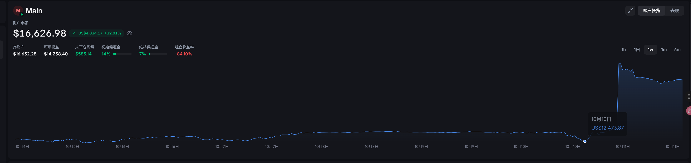

# 📢 2025.10.11 策略闭源公告

从 9 月至今，目前策略已稳定运行近一个月。  
最开始的初衷是 **开源 CTOS（Crypto Trading Operating System）** 这套系统，让缺乏系统开发能力的人，也能自由设计量化策略，并自动执行。

基于 **TopDog Index（主流币压制山寨指数）** 的策略设计，在开源代码发布之初同步开放，用于测试系统稳定性与收益表现。  
一个月的实盘运行中，系统表现稳定，收益率优秀，验证了 CTOS 的可靠性与实用性。  

然而，为防止部分用户因看到收益率曲线而 **盲目复制策略**、造成不必要的亏损，  
现决定 —— **正式闭源该交易策略。**

CTOS 系统仍将持续开源与更新，  
未来将支持用户在框架内自由设计、运行、评测和分享自己的量化策略。  
若你愿意分享自己的策略，欢迎在 [GitHub](https://github.com/) 提交你的代码。

---

## 💹 收益走势（TopDog Index 策略）

---

**CTOS 团队敬上**  
*2025 年 10 月 11 日*