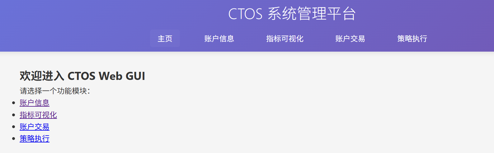
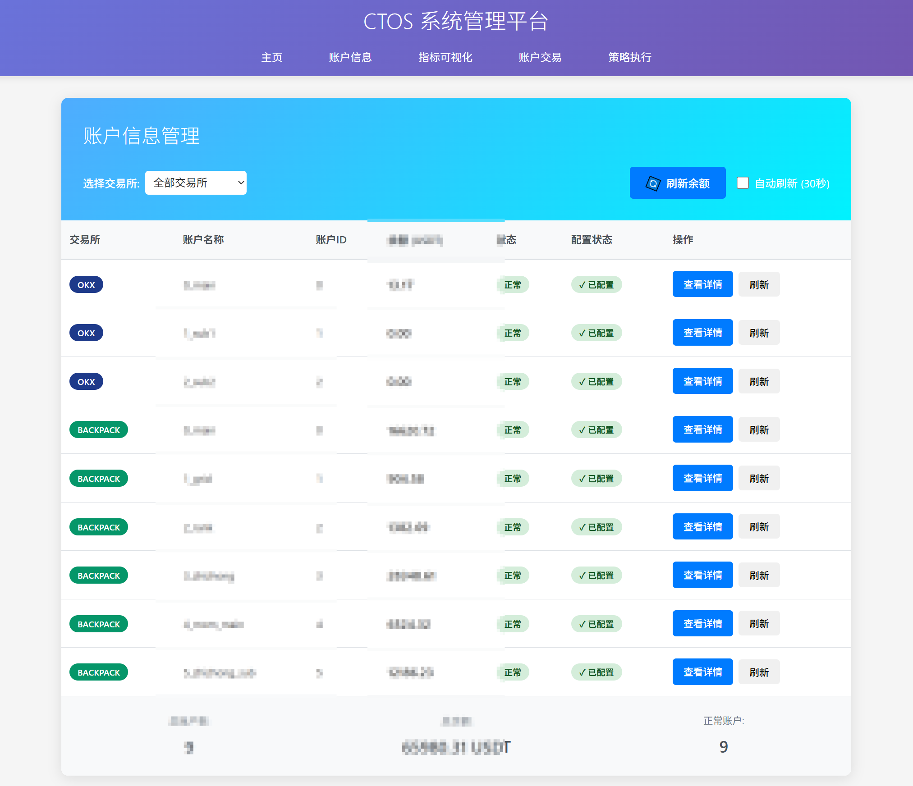
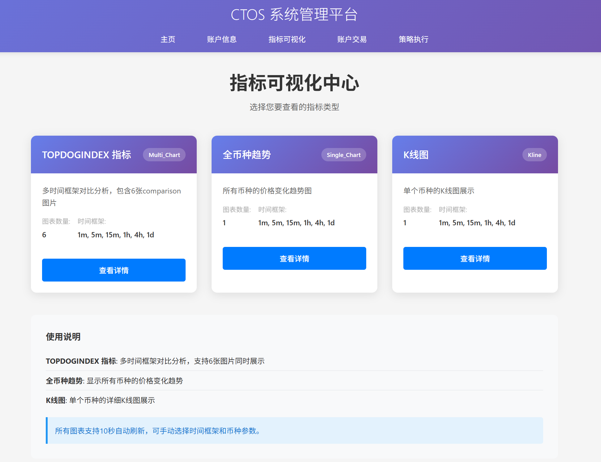

# CTOS 量化交易管理系统

一个基于Django的量化交易管理系统，提供账户管理、策略监控、指标分析等功能。

## 📋 目录

- [项目概述](#项目概述)
- [功能特性](#功能特性)
- [技术栈](#技术栈)
- [项目结构](#项目结构)
- [安装部署](#安装部署)
- [使用指南](#使用指南)
- [API接口](#api接口)
- [配置说明](#配置说明)
- [开发指南](#开发指南)
- [常见问题](#常见问题)
- [更新日志](#更新日志)

## 🎯 项目概述

CTOS量化交易管理系统是一个专为加密货币交易设计的Web应用，集成了多个主流交易所（OKX、Backpack），提供实时账户监控、策略管理、技术指标分析等功能。


*系统整体架构图*

## ✨ 功能特性

### 🏦 账户管理
- **多交易所支持**：集成OKX、Backpack等主流交易所
- **实时余额监控**：自动刷新账户余额和持仓信息
- **账户详情页面**：查看详细的仓位和订单信息
- **健康状态监控**：实时监控Driver连接状态


*账户管理主界面*

### 📊 指标分析
- **TOPDOGINDEX指标**：自定义技术指标，支持多时间周期
- **全币种趋势**：市场整体趋势分析
- **K线图表**：支持多种币种和时间间隔的K线展示
- **实时刷新**：指标数据自动更新


*技术指标分析界面*

### 🔧 策略管理
- **策略监控**：实时监控运行中的交易策略
- **参数配置**：可视化配置策略参数
- **日志查看**：策略运行日志和错误信息


*策略管理界面*

## 🛠 技术栈

### 后端技术
- **Django 4.x** - Web框架
- **Python 3.8+** - 编程语言
- **SQLite** - 数据库（开发环境）
- **AccountManager** - 自定义账户管理器
- **Exchange Drivers** - 交易所API封装

### 前端技术
- **HTML5/CSS3** - 页面结构和样式
- **JavaScript (ES6+)** - 交互逻辑
- **AJAX** - 异步数据加载
- **CSS Grid** - 响应式布局

### 第三方服务
- **OKX API** - 欧易交易所接口
- **Backpack API** - Backpack交易所接口

## 📁 项目结构

```
apps/website/
├── apps/                    # Django应用
│   ├── accounts/           # 账户管理应用
│   │   ├── views.py        # 视图函数
│   │   ├── urls.py         # URL路由
│   │   └── templates/      # 模板文件
│   └── metrics/            # 指标分析应用
│       ├── views.py        # 指标视图
│       ├── urls.py         # 指标路由
│       └── templates/      # 指标模板
├── static/                 # 静态文件
│   ├── css/               # 样式文件
│   ├── js/                # JavaScript文件
│   └── images/            # 图片资源
├── templates/              # 全局模板
├── website/               # 项目配置
│   ├── settings.py        # Django设置
│   ├── urls.py           # 主URL配置
│   └── wsgi.py           # WSGI配置
└── manage.py             # Django管理脚本
```


*项目目录结构图*

## 🚀 安装部署

### 环境要求
- Python 3.8+
- Django 4.x
- 支持的交易所API密钥

### 安装步骤

1. **克隆项目**
```bash
git clone <repository-url>
cd ctos/apps/website
```

2. **安装依赖**
```bash
pip install django
pip install -r requirements.txt
```

3. **配置环境变量**
```bash
# 复制配置文件
cp .env.example .env

# 编辑配置文件
vim .env
```

4. **数据库迁移**
```bash
python manage.py migrate
```

5. **启动服务**
```bash
python manage.py runserver
```

6. **访问系统**
打开浏览器访问：http://localhost:8000


*安装部署流程图*

## 📖 使用指南

### 账户管理

1. **查看账户列表**
   - 访问 `/accounts/` 查看所有账户
   - 系统自动显示各交易所账户余额

2. **查看账户详情**
   - 点击"查看详情"按钮
   - 查看详细仓位和订单信息

3. **刷新数据**
   - 点击"刷新全部"按钮
   - 系统自动更新所有账户数据

### 指标分析

1. **TOPDOGINDEX指标**
   - 访问 `/metrics/topdogindex/`
   - 选择时间周期和显示模式
   - 支持六图网格或单页展示

2. **全币种趋势**
   - 访问 `/metrics/allcoin-trend/`
   - 选择时间周期查看趋势

3. **K线图表**
   - 访问 `/metrics/kline/`
   - 选择币种和时间间隔


*用户操作流程图*

## 🔌 API接口

### 账户相关接口

| 接口 | 方法 | 描述 |
|------|------|------|
| `/accounts/` | GET | 获取账户列表 |
| `/accounts/<exchange>/<account_id>/` | GET | 获取账户详情 |
| `/api/accounts/balance/` | GET | 获取账户余额 |
| `/api/accounts/positions/` | GET | 获取仓位信息 |
| `/api/accounts/orders/` | GET | 获取订单信息 |

### 指标相关接口

| 接口 | 方法 | 描述 |
|------|------|------|
| `/metrics/` | GET | 指标首页 |
| `/metrics/topdogindex/` | GET | TOPDOGINDEX指标 |
| `/api/metrics/chart/` | GET | 获取图表数据 |

### 示例请求

```javascript
// 获取账户余额
fetch('/api/accounts/balance/')
  .then(response => response.json())
  .then(data => console.log(data));

// 获取仓位信息
fetch('/api/accounts/positions/?exchange=okx&account_id=0')
  .then(response => response.json())
  .then(data => console.log(data));
```

## ❓ 常见问题

### Q: 账户显示"不健康"状态怎么办？
A: 检查API密钥配置是否正确，网络连接是否正常。系统会自动重试连接。

### Q: 指标图表不显示怎么办？
A: 确保指标图片文件存在于 `static/images/` 目录下，检查文件路径配置。

### Q: 如何添加新的交易对？
A: 在对应的配置文件中添加新的交易对配置，重启服务即可。

### Q: 系统性能如何优化？
A: 
- 调整刷新频率
- 使用缓存机制
- 优化数据库查询
- 使用CDN加速静态资源


*常见问题解答图*

## 📝 更新日志

### v1.2.0 (2024-01-XX)
- ✨ 新增TOPDOGINDEX指标分析
- ✨ 支持六图网格显示模式
- 🐛 修复Backpack数据映射问题
- 🔧 优化AccountManager健康检查机制

### v1.1.0 (2024-01-XX)
- ✨ 新增账户详情页面
- ✨ 支持仓位和订单查看
- ✨ 添加实时数据刷新
- 🔧 简化AccountManager架构

### v1.0.0 (2024-01-XX)
- 🎉 初始版本发布
- ✨ 基础账户管理功能
- ✨ 多交易所支持
- ✨ 响应式界面设计


*版本更新时间线*

## 📞 联系我们

- **项目地址**: [GitHub Repository]
- **问题反馈**: [Issues Page]
- **技术文档**: [Documentation]
- **邮箱**: your-email@example.com

---

**注意**: 本项目仅供学习和研究使用，请遵守相关法律法规和交易所使用条款。


*CTOS量化交易管理系统*
